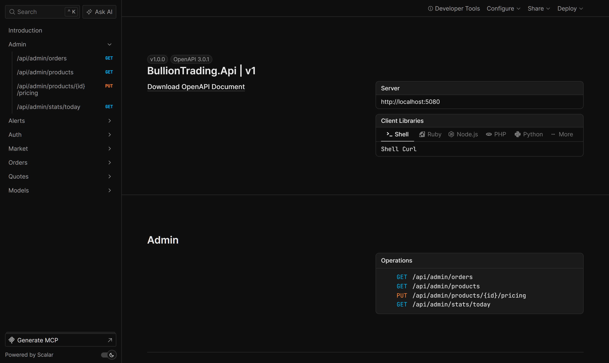
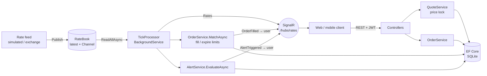

# Bullion Trading API

**A real-time gold & silver trading backend in ASP.NET Core 9: live rates over SignalR, price-locked quotes, idempotent orders, a limit-order matching engine and rate alerts.**

[](https://github.com/sudesh1456/bullion-trading-api/actions/workflows/ci.yml)


Built around the problems real bullion desks have:
- The price moves between "show price" and "confirm", so quotes lock the price.
- Mobile networks retry requests, so orders are idempotent.
- Customers want to buy when the price drops, so limit orders are filled by a matching engine.
- Traders want to know when the price moves, so rate alerts are pushed in real time.

**Frontend:** [**bullion-desk**](https://github.com/sudesh1456/bullion-desk), a React trading and admin dashboard that talks to this API over REST + SignalR ([live demo](https://sudesh1456.github.io/bullion-desk/)).



## Features

| | |
| --- | --- |
| **Live rates** | A pluggable feed publishes ticks to a `RateBook`. A simulated random-walk feed is included, so it runs without a paid data subscription. Ticks are broadcast to clients over **SignalR**. |
| **Product pricing** | Coins and bars in any purity (999 / 995 / 916) and weight, with per-product buy premium and sell discount, all in `decimal` and rounded to paise. |
| **Price-locked quotes** | `POST /api/quotes` freezes the price for 30 s (configurable). Each quote is single-use, owned by one user and expires on the injected `TimeProvider`. |
| **Idempotent execution** | `POST /api/orders` requires an `Idempotency-Key` header. Retries return the original order (`Idempotent-Replayed: true`), backed by a unique DB index to catch concurrent races. |
| **Limit orders** | Placed as `Pending`. A single-consumer tick processor fills them when marketable (with price improvement) and expires stale ones. |
| **Race-safe state changes** | Fills, cancels and expiries use conditional `UPDATE … WHERE Status = 'Pending'` (`ExecuteUpdateAsync`), so a cancel can never undo a fill. |
| **Rate alerts** | "Tell me when gold goes above X". Each alert fires exactly once and is pushed only to its owner via SignalR. |
| **Auth** | JWT bearer with `Trader` and `Admin` roles, PBKDF2 password hashing, and a per-IP rate limit on login. |
| **Admin** | View all orders, reprice or suspend products, and see today's turnover by metal. |
| **Ops** | RFC 7807 problem responses, `/health`, OpenAPI with Scalar UI, Docker image, CI with a container smoke test. |

## Architecture



Ticks are processed **sequentially by one consumer**, so the matching engine never races with itself. The only remaining concurrency is user cancels versus fills, which the conditional updates handle.

## Trading flow

```http
POST /api/auth/login        { "email": "trader@demo.test", "password": "Trader@123" }
POST /api/quotes            { "productId": 2, "side": "Buy", "quantity": 1 }
→ { "quoteId": "…", "unitPrice": 117245.63, "expiresAt": "…+30s" }

POST /api/orders            { "quoteId": "…" }
Idempotency-Key: 5f2c…      → 201 Created (a retry with the same key returns 200 + the same order)

POST /api/orders/limit      { "productId": 2, "side": "Buy", "quantity": 1, "limitPrice": 115000 }
→ 201 { "status": "Pending" }   … later a SignalR "OrderFilled" push
```

## Run it

```bash
dotnet run --project src/BullionTrading.Api --launch-profile http
# open http://localhost:5xxx/scalar
```

Or with Docker:

```bash
docker compose up --build   # http://localhost:8080/scalar
```

The database migrates and seeds itself on startup. Demo users:

| Email | Password | Role |
| --- | --- | --- |
| `trader@demo.test` | `Trader@123` | Trader |
| `admin@demo.test` | `Admin@123` | Admin |

Configuration lives in `appsettings.json`. Set `Jwt__SigningKey` (32+ chars) in any real environment.

## Tests

```bash
dotnet test
```

**29 tests**: pricing unit tests, plus integration tests that boot the real app with `WebApplicationFactory`, a private in-memory SQLite database and a `FakeTimeProvider`. They cover:
- Locked-price execution while the market moves
- Idempotent retries and single-use quotes
- Quote expiry
- Limit fills, immediate fills with price improvement, cancels and expiry
- Role-based access and admin repricing
- A **SignalR client** receiving a rate alert end to end

## Project layout

```
src/BullionTrading.Api/
├─ Domain/        entities + pure Pricing rules
├─ Rates/         RateBook (source of truth) + SimulatedRateFeed
├─ Services/      QuoteService, OrderService (matching), AlertService, TickProcessor
├─ Hubs/          RatesHub (typed SignalR client contract)
├─ Controllers/   Auth, Market, Quotes, Orders, Alerts, Admin
├─ Auth/          JWT issuing, PBKDF2 hashing
└─ Data/          EF Core context, migrations, seed data
tests/BullionTrading.Tests/
```

## Roadmap

- [ ] PostgreSQL provider and Testcontainers-based tests
- [ ] Exchange/vendor rate provider (WebSocket) behind the existing `RateBook.Publish`
- [ ] Customer wallet/ledger with double-entry balances
- [ ] Outbox for reliable notifications (email/WhatsApp) on fills

## License

MIT © [Sudesh](https://github.com/sudesh1456)
